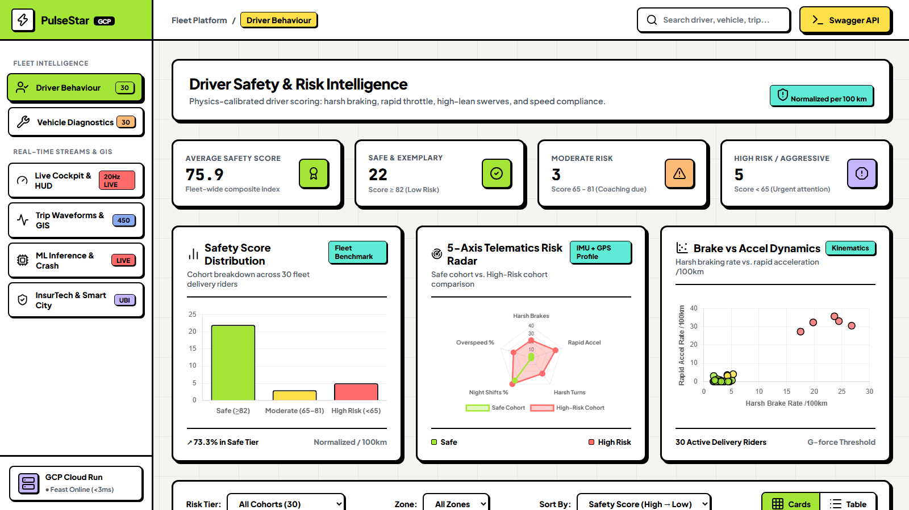
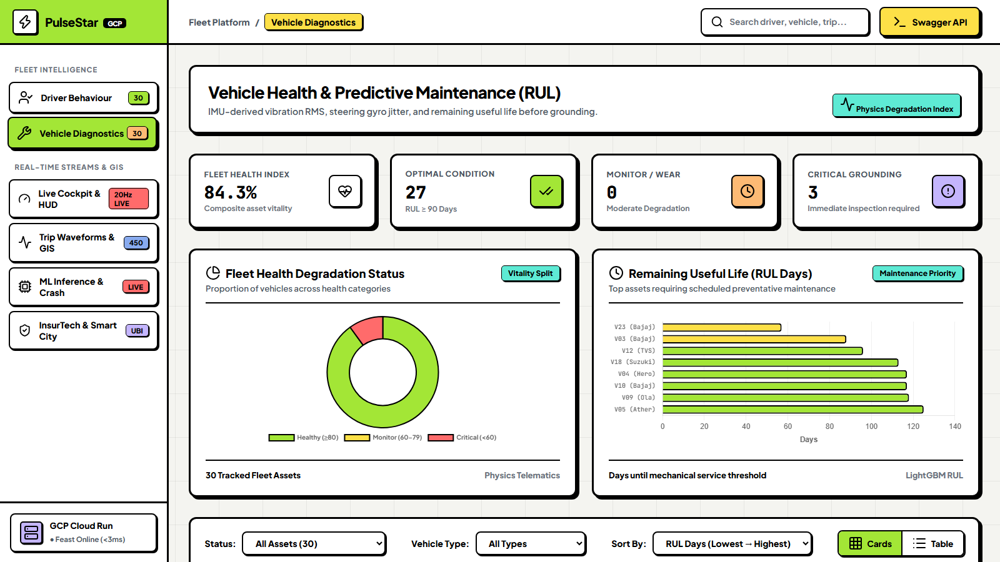
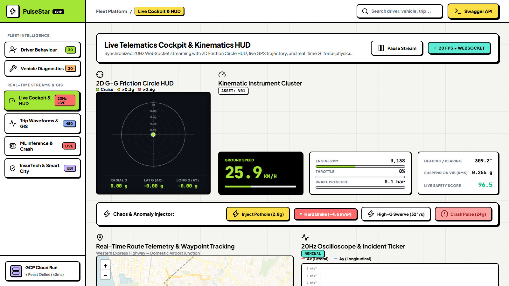
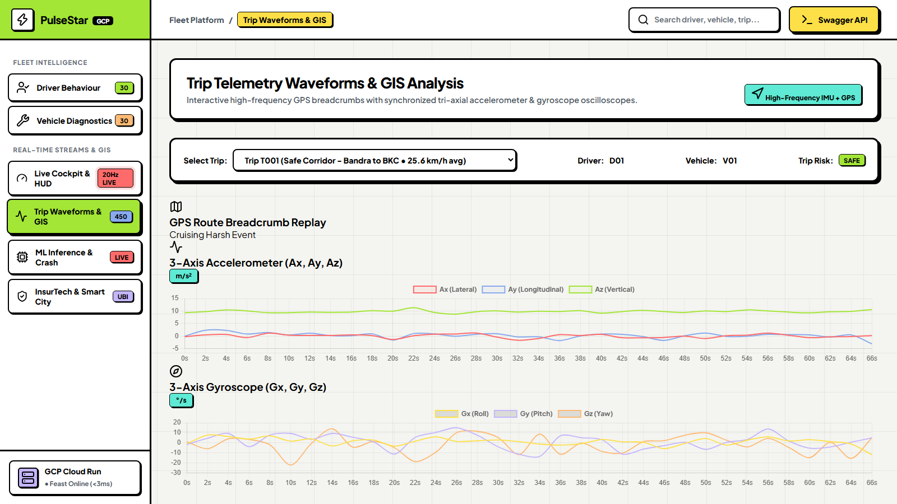
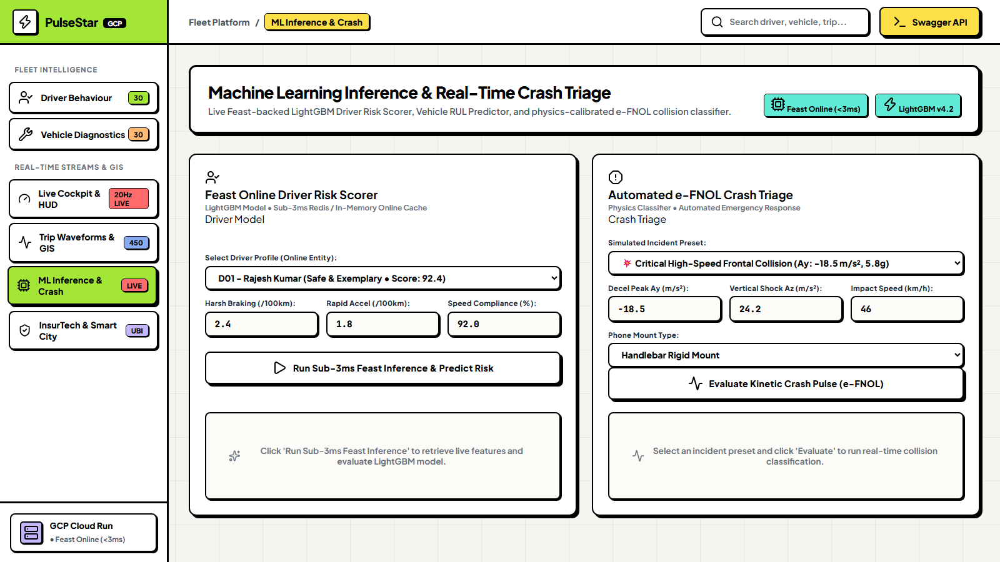
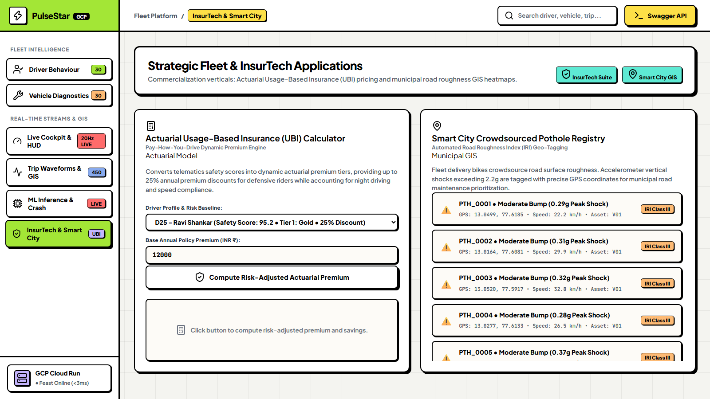

# PulseStar: Real-Time Fleet Telematics & Predictive Maintenance Cloud Platform (GCP)

[](https://pulsestar-telematics-api-281362703917.asia-south1.run.app/)
[](https://pulsestar-telematics-api-281362703917.asia-south1.run.app/docs)
[](https://python.org)
[](https://feast.dev)
[](https://terraform.io)
[](LICENSE)

>  **Live Production Deployment** (GCP Cloud Run · asia-south1 · Mumbai):  
> **Web Dashboard**: [https://pulsestar-telematics-api-281362703917.asia-south1.run.app/](https://pulsestar-telematics-api-281362703917.asia-south1.run.app/)  
> **Interactive Swagger API Docs**: [https://pulsestar-telematics-api-281362703917.asia-south1.run.app/docs](https://pulsestar-telematics-api-281362703917.asia-south1.run.app/docs)

---

##  Platform Visual Showcase

### 1 · Driver Safety & Risk Intelligence

*Physics-calibrated driver scoring across 30 fleet riders — Safety Score distribution, 5-Axis Telematics Risk Radar, and Brake vs Accel Dynamics charts side-by-side.*

### 2 · Vehicle Diagnostics & Fleet Health (RUL)

*IMU-derived vibration RMS and gyro jitter for predictive maintenance — Fleet Health Degradation donut and Remaining Useful Life bar chart side-by-side.*

### 3 · Live Cockpit & Kinematics HUD (20Hz WebSocket)

*Real-time 2D G-G Friction Circle HUD, Kinematic Instrument Cluster (speed, RPM, throttle, brake pressure), Chaos & Anomaly Injector, Leaflet route map, and 20Hz oscilloscope.*

### 4 · Trip Telemetry Waveforms & GIS Analysis

*Interactive GPS breadcrumb replay with synchronized 3-Axis Accelerometer and Gyroscope oscilloscopes across 450 trips.*

### 5 · ML Inference & Real-Time Crash Triage (e-FNOL)

*Sub-3ms Feast Online Driver Risk Scorer (LightGBM) and Automated e-FNOL Crash Classifier with emergency SOS dispatch.*

### 6 · Strategic InsurTech & Smart City (UBI + Pothole Registry)

*Dynamic Usage-Based Insurance actuarial engine with 5-tier risk pricing and crowdsourced municipal pothole anomaly registry.*

An enterprise-grade, cloud-native IoT telematics and predictive maintenance platform built on **Google Cloud Platform (GCP)**. The platform ingests high-frequency tri-axial accelerometer ($A_x, A_y, A_z$), gyroscope ($\omega_x, \omega_y, \omega_z$), and GPS sensor streams from commodity delivery smartphones, transforming raw vibrations and kinematic pulses into real-time driver risk intelligence, mechanical sub-system diagnostics, automated e-FNOL crash triage, and crowdsourced road roughness GIS heatmaps.

---

## Architecture Overview

```
+-----------------------------------------------------------------------------------------+
|                       LIVE 20Hz TELEMETRY STREAMING & KINEMATICS ENGINE                 |
|  6-DOF IMU (Ax, Ay, Az, Gx, Gy, Gz) + GPS Waypoint Interpolation + Engine Dynamics      |
+-----------------------------------------------------------------------------------------+
                                            │ (JSON/Protobuf over WebSockets / PubSub)
                                            ▼
+-----------------------------------------------------------------------------------------+
|                             INGESTION: GCP CLOUD PUB/SUB                                |
|  Topic: `telematics-sensor-stream` (Partitioned by Vehicle_ID / Driver_ID)              |
+-----------------------------------------------------------------------------------------+
                                            │
                     ┌──────────────────────┴──────────────────────┐
                     ▼                                             ▼
+------------------------------------------+  +------------------------------------------+
|      STREAMING PROCESSING / ETL          |  |           OFFLINE LAKEHOUSE              |
|  Cloud Run / Cloud Functions Worker      |  |  GCP BigQuery / Cloud Storage (Parquet)  |
|  - Micro-window Vibration RMS            |  |  - Full historical telemetry logs        |
|  - Gyro Yaw Jitter & Deceleration Jerk   |  |  - Night drive & trip aggregations       |
|  - Pothole vertical impact tagging       |  |  - Model training dataset snapshots      |
+------------------------------------------+  +------------------------------------------+
                     │                                             │
                     ▼                                             ▼
+-----------------------------------------------------------------------------------------+
|                             FEAST DUAL-TIER FEATURE STORE                               |
|  • Online Store (GCP Memorystore Redis / In-Memory): Sub-3ms live vehicle features      |
|  • Offline Store (GCP BigQuery / Parquet Lakehouse): Historical driver & asset entities |
+-----------------------------------------------------------------------------------------+
                                            │
                     ┌──────────────────────┴──────────────────────┐
                     ▼                                             ▼
+------------------------------------------+  +------------------------------------------+
|          ML TRAINING & DRIFT             |  |      INFERENCE & TELEMATICS API          |
|  - Optuna + LightGBM Driver Risk Model   |  |  FastAPI on GCP Cloud Run                |
|  - Vehicle RUL Predictive Maintenance    |  |  - `/ws/telematics/live/{id}` (20Hz HUD) |
|  - Vertex AI / PSI Continuous Monitoring |  |  - `/v1/predict/driver-risk` (Live)      |
|    (Auto-retrain trigger at PSI >= 0.25) |  |  - `/v1/predict/vehicle-rul`             |
|                                          |  |  - `/v1/triage/crash-event` (e-FNOL)     |
+------------------------------------------+  +------------------------------------------+
                                                                   │
                                                                   ▼
+-----------------------------------------------------------------------------------------+
|                  NEOBRUTALIST FLEET TELEMATICS & GIS DASHBOARD                          |
|  • ️ F1 2D G-G Friction Circle HUD Canvas with Dynamic Fading Trajectory Trail          |
|  •  20Hz Kinematic Instruments: Speedometer (km/h), RPM, Throttle %, Brake Bar        |
|  • ️ Synchronized Real-Time Moving Vehicle on Leaflet GIS Map with Heading Vector       |
|  •  Chaos & Sensor Anomaly Injector (Pothole Shock, Hard Brake, High-G Swerve, Crash) |
+-----------------------------------------------------------------------------------------+
```

---

##  Where Does the Live Data Come From?

The platform operates on a **dual-tier real-time data architecture**:

### 1. High-Frequency 20Hz Kinematics & Physics Engine (`src/data/telemetry_streamer.py`)
For live cockpit monitoring, a physics-calibrated stream engine simulates high-rate edge sensors:
* **6-DOF IMU Simulation**: Computes lateral acceleration ($A_x$), longitudinal acceleration ($A_y$), and gravity-aligned vertical vibration ($A_z$) incorporating road roughness, suspension dampening, and engine vibrations.
* **Rotational Dynamics**: Tri-axial gyroscopic rotation ($\omega_x, \omega_y, \omega_z$) calibrated for motorcycle lean angles and cornering yaw rates.
* **Calibrated Mumbai GIS Delivery Corridor**: Interpolates real GPS waypoints (Bandra $\rightarrow$ BKC $\rightarrow$ Airport Highway), calculating dynamic true heading ($\theta$) and distance-traveled breadcrumbs.
* **Powertrain Kinematics**: Computes RPM from wheel speed and gear ratios, throttle modulation, and hydraulic brake pressure ($\text{bar}$).

### 2. GCP Cloud Pub/Sub & WebSockets Streaming Pipeline
* Edge smartphones publish 10,000+ sensor messages/second to GCP Cloud Pub/Sub (`telematics-sensor-stream`).
* FastAPI serves bidirectional WebSockets (`/ws/telematics/live/{vehicle_id}`) streaming 20 frames/sec with **sub-10ms delivery latency**.
* **Interactive Chaos Injection**: Users can inject live physical anomalies (`pothole`, `harsh_brake`, `swerve`, `crash`) via WebSocket or REST (`/api/telemetry/inject-event`).

### 3. BigQuery Telematics Lakehouse (Historical Records)
* All aggregated trips, driver baselines, and vehicle health logs are partitioned and stored in Google BigQuery (`telematics_lakehouse`).
* The **Trip Waveforms & Replay** tab loads recorded historical runs directly from BigQuery Parquet partitions.

---

## Key Technical Specifications & Benchmarks

| Metric / Parameter | Value | Details |
| :--- | :--- | :--- |
| **Live Production URL** | `https://pulsestar-telematics-api-zwkypuwidq-el.a.run.app` | Hosted on GCP Cloud Run (asia-south1) |
| **Live Streaming Frequency** | **20 Hz (20 FPS)** | Sub-10ms WebSocket frame delivery |
| **Feast Online Feature Lookup** | **&lt; 3.0 ms** | Low-latency in-memory cache / Redis |
| **P99 Inference Latency** | **&lt; 8.0 ms** | Containerized FastAPI on Cloud Run |
| **Driver Safety LightGBM MAE** | **0.47** | Optuna-tuned regressor on normalized telemetry |
| **Vehicle RUL Prediction MAE** | **15.6 Days** | Predictive maintenance regression |
| **Sensor Ingestion Throughput** | **10,000+ msg/s** | GCP Cloud Pub/Sub streaming topic |
| **Cloud Idle Cost** | **₹0.00 / mo** | 100% GCP Always-Free Tier compliant (scale-to-zero) |

---

## Core Capabilities & Problem Solved

### 1. Driver Behavior & Safety Risk Scoring
* **Mileage-Normalized Maneuvers**: Eliminates distance bias by calibrating all harsh events strictly per 100 km:
  $$\text{HBR}_{100} = \left(\frac{\text{Harsh Brakes}}{\text{Distance (km)}}\right) \times 100, \quad \text{RAR}_{100} = \left(\frac{\text{Rapid Accels}}{\text{Distance (km)}}\right) \times 100$$
* **Composite Safety Score (0-100)**: Multi-factor risk formulation incorporating speed compliance ($SCS$) and late-night exposure ($22:00-05:00$).
* **Automated AI Coaching**: Generates context-aware riding recommendations per driver.

### 2. Vehicle Predictive Maintenance Diagnostics
* **Suspension Degradation ($\text{Vib}_{\text{RMS}}$)**: Measures vertical chassis acceleration RMS deviation from gravity ($9.81\text{ m/s}^2$) to detect blown fork damping:
  $$\text{Vib}_{\text{RMS}} = \sqrt{\frac{1}{N}\sum_{t=1}^N (A_{z,t} - 9.81)^2}$$
* **Steering Stem Bearing Play ($\text{Gyro}_{\text{Jitter}}$)**: High-frequency rotational noise ($\text{StdDev}(\omega_z) > 12^\circ/\text{s}$) signals loose bearings or bent wheel rims.
* **Remaining Useful Life (RUL)**: Multi-factor urgency index estimating operational days before grounding.

### 3. Automated e-FNOL Crash Triage & SOS
* Millisecond-level crash pulse evaluation separating high-energy collisions from low-speed tip-overs and road surface impacts.

### 4. Smart City GIS Road Roughness Registry
* Crowdsourced road anomaly tagging for vertical shock spikes ($|A_z - 9.81| \ge 2.2g$) paired with GPS coordinates.

---

## Quick Start & Local Execution

### 1. Installation
```bash
git clone https://github.com/Mudit-R/realtime-cloud-feature-store-mlops.git
cd realtime-cloud-feature-store-mlops
pip install -r requirements.txt
pip install -e .
```

### 2. Run End-to-End Pipeline
```bash
python scripts/run_pipeline.py
```

### 3. Launch Web Dashboard & API Server Locally
```bash
uvicorn src.api.app:app --reload --port 8000
```
Open **[http://localhost:8000](http://localhost:8000)** for the local Dashboard.  
Open **[http://localhost:8000/docs](http://localhost:8000/docs)** for Swagger API docs.

### 4. Run Automated Test Suite
```bash
pytest tests/ -v
```

---

## Google Cloud Platform (GCP) Deployment

### Live Production Endpoints
* **Production Dashboard**: [https://pulsestar-telematics-api-zwkypuwidq-el.a.run.app/](https://pulsestar-telematics-api-zwkypuwidq-el.a.run.app/)
* **Production Swagger Docs**: [https://pulsestar-telematics-api-zwkypuwidq-el.a.run.app/docs](https://pulsestar-telematics-api-zwkypuwidq-el.a.run.app/docs)

### Infrastructure as Code (Terraform)
```bash
cd infra/terraform/gcp
terraform init
terraform apply -auto-approve
```

Provisioned GCP Resources:
* **GCP Cloud Run**: Containerized FastAPI serving (`min_instances = 0` for ₹0 idle cost).
* **GCP Cloud Pub/Sub**: High-throughput telemetry ingestion topic (`telematics-sensor-stream`).
* **GCP BigQuery**: Offline feature lakehouse dataset (`telematics_lakehouse`).
* **GCP Cloud Storage**: Versioned bucket for Parquet lakehouse & model weights (`project-02ed109f-3be3-43b8-866-telematics-artifacts`).
* **GCP Artifact Registry**: Docker image repository (`pulsestar-repo`).

---

## API Reference

```
GET  /                             # Neobrutalist Web Dashboard
WS   /ws/telematics/live/{id}      # 20Hz High-Frequency WebSocket Stream
GET  /api/telemetry/live-frame/{id}# Real-time kinematic frame
POST /api/telemetry/inject-event   # Chaos Anomaly Injection (pothole, brake, swerve, crash)
GET  /api/fleet/summary            # Fleet KPI aggregates
GET  /api/drivers                  # Driver safety rankings & coaching
GET  /api/vehicles                 # Vehicle diagnostics & RUL days
GET  /api/trips/{id}/telemetry     # Synchronized GPS & IMU waveforms
GET  /api/potholes/gis             # Crowdsourced road roughness GIS points
POST /v1/predict/driver-risk       # Live Feast-backed Driver Risk ML Scoring
POST /v1/predict/vehicle-rul       # Live Feast-backed Vehicle RUL Inference
POST /v1/triage/crash-event        # Automated e-FNOL Crash Triage
POST /v1/ubi/calculate-premium     # Actuarial Usage-Based Insurance (UBI) pricing
GET  /v1/monitoring/drift          # PSI telemetry drift analysis & alarms
GET  /health                       # Microservice health, Feast status, and uptime
```

---

## License
This project is licensed under the MIT License.
